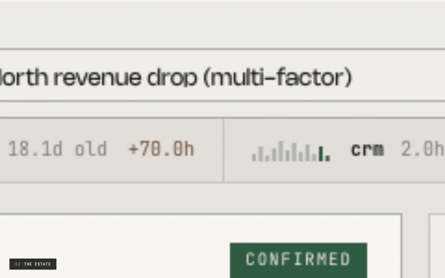

# KAIRÓS

**A KPI intelligence-to-action engine.** It detects a material metric movement,
decomposes it exactly, tests each explanation against a graded standard of proof,
and recommends an action with a named owner — or refuses, and prices the cheapest
experiment that would settle the question.

*Kairós* — the opportune moment. The distance between a number moving and someone
acting on it is where the value sits.

Built for the **Accenture Innovation Challenge 2026 · BusinessIntelligence.ai**.

---

## Demo

<video src="https://github.com/aswanthiitm/kairos/raw/main/docs/demo.mp4" controls muted playsinline width="900"></video>

[](https://github.com/aswanthiitm/kairos/raw/main/docs/demo.mp4)

**▶ [Watch the full 2:52 narrated walkthrough](https://github.com/aswanthiitm/kairos/raw/main/docs/demo.mp4)** — with audio.
The loop above is silent and shows six moments from it.

The walkthrough covers the live estate, a confirmed finding at the top of the evidence
ladder, the abstention that prices its own separating test, the data-quality catch, the
entitlement refusals, and the numeric guard rejecting a figure the model invented.

---

## Run it

```bash
git clone https://github.com/aswanthiitm/kairos && cd kairos
./run.sh                      # installs, builds the estate, serves on :8000
```
No API key required. The engine runs complete without a language model and says so.

---

## The one architectural commitment

> Language models are strong at **proposing** causal explanations from world
> knowledge and near-random at **inferring** causation from correlation.
> So the model proposes and phrases. It never decides, and it never computes.

Kıcıman et al. (TMLR 2024) found LLMs beat existing algorithms on knowledge-based
causal tasks. The Corr2Cause benchmark (ICLR 2024) tested seventeen models on
inferring causation from correlation and found them near random. Both are true.
The architecture is a direct read of where the split falls.

It is enforced at runtime, not asserted:

- the model receives a **closed evidence packet** of already-computed facts, with
  no tools and no data access, so it cannot compute;
- afterwards a **numeric guard** parses every figure in its output and matches it
  against that packet. An unverifiable number fails the narrative, which is retried
  once and then replaced by the deterministic narrator.

Measured on a live run: **91–100% of reasoning steps are non-LLM**, and every step
declares its own method and the reason that method was chosen.

---

## Ten stages

| Stage | Question | Method | Refuses to |
|---|---|---|---|
| **SEMANTIC** | Whose definition of this metric? | Rules · SQL | Compute a KPI two systems define differently without resolving the conflict |
| **FITNESS** | Is this estate fit to reason over? | Rules · SQL | Analyse an estate that fails the gate |
| **DRIFT** | Has the ground moved under the baseline? | Statistics · ML | Trust a learned ranker outside its training support |
| **SIFT** | Is the change real, and does it matter? | Statistics · Rules | Wake anyone for a statistically real but immaterial move |
| **SPLIT** | Where exactly? | Deterministic algebra | Leave a residual — the identity closes to under ₹1 |
| **SOURCE** | Why, and how sure? | Causal · Statistics · Retrieval · ML | Award L3 when the placebo test fails |
| **PROPAGATE** | Where in the chain is the loss created? | Causal · SQL | Measure an upstream cause in its effect's window |
| **FORECAST** | What if nobody acts? | Statistics | Present an extrapolation in the same voice as a counterfactual |
| **SOLVE** | What should someone do? | Retrieval · Rules | Emit an action whose lever isn't in the contract |
| **NARRATE** | How do we say it to this reader? | LLM · Deterministic | Publish a number that isn't in the evidence packet |

---

## The Evidence Ladder

Bradford Hill's viewpoints (1965) operationalised on Pearl's causal hierarchy
(CACM, 2019). **Nothing below L2 is ever phrased as a cause.**

| Rung | Test | Language permitted |
|---|---|---|
| **L0** | co-movement | *"moved alongside"* |
| **L1** | precedence within the graph's declared lag, plus a dose–response gradient | *"associated with"* |
| **L2** | independent corroboration — sources not sharing a pipeline agree, and conflicting evidence is under 40% | *"likely cause"* |
| **L3** | counterfactual — difference-in-differences on the log-ratio series against a real untreated cohort, with a placebo test that must validate first | *"quantified at −20.6%, p<0.0001"* |

The ladder is **not cumulative**. A validated counterfactual needs no text at all,
so a persona denied CRM verbatims still reaches L3 on structured evidence.

**Conflict is measured, not assumed.** Evidence supporting a rival theme is counted;
above a 0.4 ratio the hypothesis is marked *contested* and cannot reach L2.

| Case | on-theme | conflicting | ratio | verdict |
|---|---|---|---|---|
| Dispatch SLA | 12 | 0 | 0.00 | corroborated → **L3** |
| Price increase | 2 | 10 | **0.83** | **contested — rung suppressed** |

---

## The governed contract

Five YAML files, 545 lines. This is the surface a client tunes; the engine is portable
across sectors without touching Python.

| File | Carries |
|---|---|
| `kpi_contract.yaml` | Sources with grain, cadence and freshness SLA. Five KPIs with SQL, additivity, drivers, materiality thresholds, sliceable dimensions, lineage, access class. Six levers with owner, decision right, authority limit, reversibility. |
| `causal_graph.yaml` | Nodes with observables and type. Edges with sign, **lag in days**, and a mechanism an analyst can defend. Explicit blocks with reasons. |
| `entitlements.yaml` | Personas with row filters, denied columns, denied evidence domains, PII policy, narrative shape, delivery channel. |
| `playbooks.yaml` | Past interventions with **measured** outcomes — recovery rate, weeks to effect, cost, measurement method. |
| `llm_pricing.yaml` | Per-model prices, FX, and the routing policy. |

Two rules the contract enforces absolutely: **an undeclared KPI cannot be computed**,
and **an undeclared lever cannot be recommended**.

### Semantic reconciliation

Finance and Operations define net revenue differently — one deducts returns, one also
deducts shipping. Both are correct inside their own system. KAIRÓS resolves the
conflict once, before analysis, records which definition won and under whose authority,
and reports the gap. It does not silently pick one.

### Fiscal calendar and hierarchy

Periods are computed on the declared **April–March Indian fiscal year**, not the
Gregorian calendar. Dimensions carry real hierarchies — `region → city` — and the
engine traverses them, so a regional movement drills to the cities that caused it and
rolls back up exactly.

---

## What is in the box

**Five connected KPIs across four sources**, three grains, four refresh cadences
(60 / 1440 / 15 / 10080 minutes). They are causally connected, not merely co-located:

```
otd_pct ──10d──▶ reorder_rate_28d ──▶ order_volume ──▶ net_revenue
                                            ▲               ▲
                                            └──── asp ──────┘
                                     (identity: revenue = volume × price)
```

**Five cases**, each with ground truth planted in the generator so the engine can be
*scored* rather than admired:

| | Case | Planted | Verdict |
|---|---|---|---|
| **S1** | North revenue −18.8% | WH-3 dispatch SLA collapse → three named accounts cut reorder cadence at a 10-day lag, plus a tier-mix shift | **CONFIRMED · L3** |
| **S2** | West volume −8.9% | A competitor promotion and our own price rise, same day, same channel, no clean control | **COMPETING** |
| **S3** | New category, 19 days | Too short to fit seasonality | **INSUFFICIENT_HISTORY** |
| **S4** | WH-4 on-time delivery "improves" | Late-shipment rows silently stopped loading | **DATA_QUALITY** |
| **S6** | South modern trade −18.9% | Competitor promotion hitting one channel only — the other channels are an untreated control | **CONFIRMED · L3** |

S2 and S6 are deliberate mirrors: the same class of cause, one confounded by design and
one clean. The pair is what makes the abstention in S2 read as judgement.

---

## Security

Entitlements are applied to the data and the evidence set **before anything reaches a
prompt**. Post-filtering generated text is not a control an auditor will accept.

| Persona | Row | Column | Domain | Result on S1 |
|---|---|---|---|---|
| CFO | all | — | no CRM verbatims | L3 via counterfactual; 23 items withheld |
| RSM North | `region = North` | no margin | — | refused outright on a West query |
| Supply Chain | all | **no ₹ at all** | no verbatims | movement as % only; packet holds no currency figure |
| Analyst | all | — | — | full method detail and lineage |

Three enforcement points: **pre-flight refusal** before any query runs, **row filters
compiled into SQL**, and **packet-level redaction** so a denied figure cannot reach the
model. A test asserts the Supply Chain packet contains no rupee value anywhere.

---

## Decision rights are machine-checkable

Each recommendation is routed to a human–AI collaboration mode derived from evidence
grade × value at risk against the owner's authority limit × lever reversibility.

| Recommendation | Mode | Why |
|---|---|---|
| Counter-promotion, ₹0.7 L | `AI_LED_HUMAN_APPROVES` | L3, reversible, inside authority |
| Service credit, ₹44.6 L | `HUMAN_LED_AI_SUPPORTS` | L3, but **exceeds the RSM's ₹25 L limit** |
| Price correction | `HUMAN_LED_AI_SUPPORTS` | hard to reverse |
| Under abstention | `HUMAN_ONLY_AI_ABSTAINS` | no cause established |
| — | `AI_DELEGATED` | **reserved and never assigned; a test enforces it** |

Every lever is externally visible to a customer, moves money, or both. Full delegation
is left empty on purpose, which makes EU AI Act Art. 14 human oversight an inspectable
property of each recommendation rather than a policy sentence.

---

## The learned layer

A gradient-boosted ranker (**written in numpy**, no ML framework dependency) trained on
resolved historical episodes. Its authority is deliberately narrow, and stated in its
own output:

> *advisory-reorder-only: the ML score may reorder candidates within the set the evidence
> ladder already admitted, and may not promote a rung, alter a verdict status, or add or
> remove a candidate.*

It exists because the hand-designed ranking multiplies by explanatory power, so a driver
carrying no share of the movement — a competitor promotion, a price move — could never
rank first however strong its evidence. The ranker learns that trade-off from outcomes.
Holdout top-1 accuracy **0.60 against 0.32** for the heuristic.

The drift stage checks every scored candidate against the p01–p99 feature range recorded
at training time. If too many fall outside, **the ranker's authority is withdrawn for
that run** and the evidence heuristic ranks alone.

---

## Estate operations

```
python cli.py --sweep
  scanned 73 slices → 24 material, 9 data-quality, 16 insufficient history, 24 suppressed
  suppressed because:
    persistence     20   did not persist for the required number of days
    statistical      8   inside the expected band once seasonality is removed
    pct_of_plan      4   movement is too small a share of the period plan
    abs_inr          1   below the rupee materiality floor in the contract
  grain-blocked: otd_pct × segment — measured at shipment grain, which carries no segment
```

Alert fatigue is a measured property, not a claim. The sweep also shrinks with
entitlement: the analyst scans 73 slices, the North RSM 58.

```
python cli.py --backtest
  20 windows, 1 alert (rate 0.05), precision 1.00, recall 0.25
```

Twenty rolling windows across four quiet months, one alert, and it was the real event.
Recall stays in the output: the event spans four windows and only became material in the
last one. An engine that cannot report its own false-alarm rate is asking to be trusted
on faith.

---

## Cost, latency and scale

| | |
|---|---|
| End-to-end, offline | **≈450 ms** |
| Repeat run (narrative cache hit) | **≈80 ms**, zero tokens, zero cost |
| Cost per insight | **₹0.30** — one call, ~2.5k in / ~200 out on Haiku 4.5 |
| Non-LLM reasoning steps | **91–100%** |

The system prompt is marked for provider-side prompt caching; the narrative cache keys
on a hash of the evidence packet, so identical evidence for the same persona never pays
twice.

**Scale** — `python scripts/benchmark.py --scales 1 10 100`, on a laptop:

| rows | daily aggregate | lattice scan | cohort DiD |
|---|---|---|---|
| 45,065 | 0.3 ms | 0.6 ms | 0.4 ms |
| 450,650 | 0.8 ms | 0.9 ms | 0.7 ms |
| **4,506,500** | **3.2 ms** | **2.2 ms** | **1.9 ms** |

Those are the three queries SIFT, SPLIT and the counterfactual actually run. Everything
else in a run is bounded by the segment and window, not by estate size.

---

## The feedback loop

Analysts grade a diagnosis; the prior re-weights and the leader ranking changes on the
next run. A **correction** — an analyst saying what the cause actually was — is stored as
a labelled counter-example and surfaced on every later run of the same shape until
someone amends the causal graph or a playbook. A recorded **outcome** re-estimates the
playbook's effect size as a weighted mean, so expected-impact figures are calibrated by
this company's own track record.

Learned state lives in `runtime/` and `cli.py --reset` clears it. A system that learns
needs an explicit way to forget.

---

## Running it

```bash
./run.sh                                   # web UI on :8000
python cli.py --scenario S1 --persona cfo  # headless single run
python cli.py --all                        # every case × persona
python cli.py --sweep --backtest           # estate operations
python cli.py --reset                      # clear learned state
python scripts/benchmark.py                # scale curve
python -m pytest tests/ -q                 # 125 tests against planted ground truth
export ANTHROPIC_API_KEY=sk-...            # optional: live narration
```

Without a key the deterministic narrator runs. Two simulation modes exercise the full
LLM path including token accounting; `simulate_bad` injects a fabricated figure so the
numeric guard can be seen firing and falling back.

### Interfaces

Web UI, CLI, and direct import of `pipeline.run()` share one engine. The UI is
deep-linkable — every state is a URL — and carries a live feed ticker showing each
source ageing and counting down to its next refresh.

### API

`GET /api/meta` · `/api/freshness` · `/api/analyse` · `/api/sweep` · `/api/backtest` ·
`/api/semantics` · `/api/ml` · `/api/learning` — `POST /api/feedback` · `/api/outcome` ·
`/api/reset`

---

## Platform mapping

Built custom on DuckDB so it runs anywhere with no account. The distinction the brief
asks for:

| Capability | Classification |
|---|---|
| Query execution | Custom-built on an embedded engine; maps to **native** warehouse SQL |
| Semantic contract & reconciliation | Custom-built; would be **configured** on dbt / Unity Catalog |
| Row / column / domain security | Custom-built; would be **native** on Snowflake or Unity Catalog |
| Text retrieval (BM25) | Custom-built; would be **native** via Cortex Search |
| Evidence ladder, mechanism ledger, delegation router | **Custom-built — no native equivalent exists** |
| Playbook memory | **Custom-built — no native equivalent exists** |
| Learned driver-ranker | Custom-built (numpy GBDT) |
| Narration | **Externally integrated** (Anthropic API), optional |

The two rows marked *no native equivalent* are the product. We deliberately do not
rebuild text-to-SQL or the semantic layer — Cortex Analyst, Databricks Genie and BigQuery
Gemini were all GA by mid-2026. That layer is a platform feature now.

---

## Repository

```
config/     semantic contract · causal graph · entitlements · playbooks · pricing
data/       seeded generator with planted ground truth; DuckDB estate
kairos/     31 engine modules, including ml/ — the learned ranker and its trainer
app/        FastAPI service and the single-page UI
tests/      125 tests scored against ground truth
scripts/    scale benchmark
docs/       business proposal · developer reference · demo video
design/     the interface design canvas
```

---

## Limitations

Stated plainly, because the whole thesis is about not overclaiming.

- **Synthetic data.** Effect sizes are recovered because they were planted. On real data
  the honest expectation is more L1 and L2 and fewer L3s.
- **A counterfactual needs a real control.** Where every unit is treated, the engine
  correctly returns L1 and abstains. This is common.
- **The causal graph is hand-curated.** That is the point — it encodes domain judgement —
  but it is maintenance, and a wrong edge silently blocks a true cause.
- **BM25, not embeddings.** Fine at this scale; a production corpus needs a vector index.
- **Three seeded playbooks.** The asset compounds only with use.
- **The numeric guard is magnitude-tolerant** at 1% to survive rounding, so a fabricated
  figure landing within 1% of a real one can pass. It is a strong filter on material
  fabrication, not a proof of correctness.
- **Forecasting is trend continuation only** — no competitor response, no regime change.
  Beyond about four weeks it is indicative, not a number to plan against.
- **Delivery writes to an outbox and does not send.** There is no transport configured,
  and the code says so rather than implying otherwise.
- **Confidence is composed, not yet calibrated against realised outcomes.** The
  calibration machinery exists for the ranker; the recommendation confidence does not
  have enough closed loops behind it to claim calibration.

## Licence

MIT. Synthetic data only; no real customer data is included.
